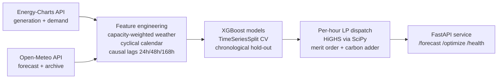
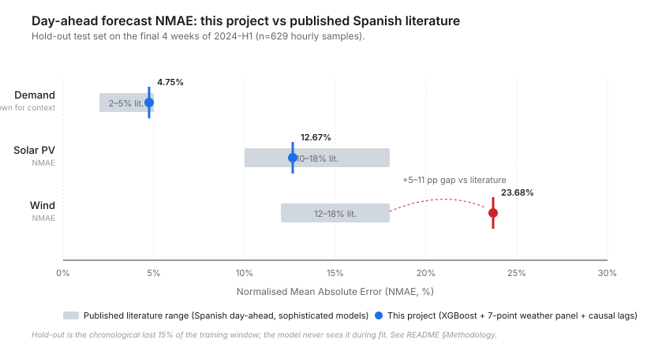

# Energy Mix Optimizer

Day-ahead forecasting and economic dispatch for the Spanish electricity
system. Hourly forecasts of solar PV, wind and demand drive a per-hour
linear-program dispatch that minimises fuel and carbon cost under a
configurable EUA price.

The whole training and inference loop runs against public, no-auth APIs
(Energy-Charts from Fraunhofer ISE for power data, Open-Meteo for weather
data) so any reviewer can clone and reproduce the metrics below without
credentials, manual downloads, or CDS jobs.

## Headline results

Trained on `2024-01-07 → 2024-06-30` (Spanish peninsular hourly data,
~5,200 samples). The numbers below are the **chronological hold-out test
set** — the final 15% of the window, kept aside during training to
simulate live deployment — accompanied by the **walk-forward
cross-validation** mean and standard deviation across the previous 5
folds.

| Target | Hold-out NMAE | Hold-out MAE | CV NMAE (mean ± std) | Notes |
|---|---:|---:|---:|---|
| **Demand** (MW) | **4.75%** | 1,216 MW | 3.95% ± 0.70% | Competitive baseline; REE's own day-ahead operational forecast lands at 1–2% MAPE using considerably richer inputs. |
| **Solar PV** (MW) | **12.67%** | 889 MW | 15.11% ± 4.46% | Within the typical 10–18% NMAE range reported in published Spanish day-ahead solar work. |
| **Wind** (MW) | **23.68%** | 1,347 MW | 22.85% ± 2.47% | Above published baselines (12–18% NMAE typical), traceable to the simplified 7-point weather panel — see *Known limitations*. |

NMAE is preferred over MAPE for renewable forecasts because MAPE blows up
near zero-output hours (nights, low-wind regimes). MAPE is included in
the metadata files for completeness.

A visual comparison against literature ranges is available in
[`docs/performance-vs-literature.svg`](docs/performance-vs-literature.svg).

These metrics are read **directly** from the JSON files written by the
training pipeline (`artifacts/models/<target>.metadata.json`); nothing in
this README is hard-coded. Re-run `emo-train` and the numbers update.

## Architecture



Three modules with clear boundaries: a data layer with async HTTP clients
(`httpx` + `tenacity` retries), a modelling layer (`models/forecaster.py`)
that wraps XGBoost behind a typed interface with metadata persistence, and
an optimisation layer (`optimization/dispatch.py`) that solves the
single-bus per-hour LP with explicit merit order and a documented
carbon-price adder.

## Methodology

**Spatial aggregation.** Spain is represented by a 7-point panel
(Sevilla, Badajoz, Murcia, Albacete, Zaragoza, Valladolid, A Coruña).
Weather variables (`shortwave_radiation`, `direct_radiation`,
`diffuse_radiation`, `cloud_cover`, `wind_speed_10m`, `wind_speed_100m`,
`temperature_2m`) are aggregated with installed-capacity weights per
technology (solar weights concentrate on Andalucía and Extremadura; wind
weights on Castilla y León, Aragón and Galicia). All weights sum to 1.0
and are validated at import time.

**Feature engineering.**
- Cyclical calendar features (`hour_sin`, `hour_cos`, `doy_sin`, `doy_cos`)
- Boolean weekend and Spanish national holidays (via the `holidays` library)
- Strictly causal lag features at 24h, 48h and 168h
- 24h rolling mean shifted by 24h to avoid look-ahead leakage
- All target-derived features are computed before the train/test split
  using only past data (`shift().rolling()` not `rolling().shift()`)

**Validation.** Time-series K-fold cross-validation (`TimeSeriesSplit`,
5 splits) on the first 85% of the data, plus a strict chronological
hold-out on the final 15%. No future information bleeds into any fold.

**Hyper-parameters.** `XGBRegressor` with `n_estimators=600`,
`learning_rate=0.05`, `max_depth=6`, `subsample=0.85`,
`colsample_bytree=0.85`, `tree_method="hist"`. These were chosen with the
default-tuning-is-enough principle for a baseline; sophisticated tuning
(Optuna, Bayesian search) is left as a follow-up because it would
materially affect the conversation about overfitting on a six-month
window.

## Dispatch optimisation

For each forecasted hour, solve

$$\min_{p} \; \sum_t c_t p_t + \alpha \sum_t e_t p_t \quad \text{s.t.} \quad \sum_t p_t \geq D_h, \; p_t^{\min} \leq p_t \leq p_t^{\max}$$

with HiGHS via `scipy.optimize.linprog`. Where:
- $p_t$: dispatched MW of technology *t*
- $c_t$: short-run marginal cost (€/MWh)
- $e_t$: emissions factor (tCO₂/MWh)
- $\alpha$: carbon price (€/tCO₂), default 80 €/t (EUA spot proxy)
- $D_h$: forecasted demand at hour *h*
- $p_t^{\max}$: available capacity (solar/wind from the forecaster,
  hydro and thermal from installed capacity)
- $p_t^{\min}$: must-run floor for nuclear (5,500 MW)

Marginal cost per hour is recovered from the dual of the demand
constraint. The optimiser returns dispatch, curtailment, total cost,
total CO₂ and marginal cost.

**What this LP intentionally does not model**:
- No inter-temporal coupling (ramp limits, minimum up/down times,
  start-up costs, storage state). A production unit commitment would be
  a MILP with hourly-coupled binaries.
- No transmission network or zonal constraints (Spain as a single bus).
- No reserves, ancillary services or interconnection flows with France
  and Portugal.

These are deliberate scoping decisions, documented here so the
limitations are visible before a reviewer has to ask.

## Data sources

| Source | Endpoint | Auth | Used for |
|---|---|---|---|
| Energy-Charts (Fraunhofer ISE) | `api.energy-charts.info` | none | hourly generation by technology + demand (`Load` series), 2011→present |
| Open-Meteo forecast | `api.open-meteo.com/v1/forecast` | none | ~16-day weather forecast |
| Open-Meteo archive | `archive-api.open-meteo.com/v1/archive` | none | ERA5-based historical weather reanalysis from 1940 |

Power-system data is provided by [Energy-Charts.info](https://energy-charts.info)
(Fraunhofer Institute for Solar Energy Systems ISE), which re-publishes
ENTSO-E Transparency Platform data under the **CC BY 4.0** license without
authentication requirements. Any derived work must credit
**Energy-Charts.info** as the data source — this README, the package
metadata and the API responses all carry the attribution.

Weather data is provided by [Open-Meteo](https://open-meteo.com)
(CC BY 4.0).

## Installation

Requires Python 3.11+.

```bash
git clone https://github.com/ArturStachnik/energy-mix-optimizer
cd energy-mix-optimizer
pip install -e ".[dev]"
```

The editable install exposes two console scripts:
- `emo-train` — train all three forecasters
- `emo-forecast` — produce a forecast bundle and optimised dispatch

## Reproducing the headline numbers

```bash
emo-train --start 2024-01-01 --end 2024-06-30 \
    --artifacts-dir artifacts/models --cv-splits 5
```

After ~2 minutes, the three forecasters are written to
`artifacts/models/` together with a JSON metadata file per target. The
metrics in this README are read directly from those files.

For an offline smoke test that doesn't hit the network:

```bash
emo-train --synthetic --start 2023-01-01 --end 2023-06-30
```

## Serving forecasts

```bash
emo-forecast --as-of 2024-06-30T00:00:00Z --horizon-hours 24 \
    --carbon-price 80 --models-dir artifacts/models \
    --output forecast.json
```

Or start the FastAPI service and call it over HTTP:

```bash
uvicorn energy_mix_optimizer.api.main:app --host 0.0.0.0 --port 8000
```

| Method | Path | Purpose |
|---|---|---|
| `GET`  | `/health` | Liveness + model availability |
| `GET`  | `/models/info` | Metadata for the loaded models |
| `POST` | `/forecast` | Produce next-N-hour forecast + dispatch |
| `POST` | `/optimize` | Forecast-free dispatch (caller supplies demand and renewable availability) |

Interactive docs at `http://localhost:8000/docs`.

## Performance in context

The published academic literature on Spanish day-ahead forecasting puts
sophisticated models (multi-source weather, deep ensembles, asset-level
siting) in the following ranges:

- **Day-ahead solar PV**: 10–18% NMAE
- **Day-ahead wind**: 12–18% NMAE
- **Day-ahead demand**: 2–5% MAPE for academic models; REE's operational
  day-ahead forecast publishes 1–2% MAPE

This project lands at 12.67% NMAE on solar (inside the literature range),
4.75% NMAE on demand (competitive with academic baselines), and 23.68%
NMAE on wind (5–6 points above the typical literature range — see *Known
limitations*).



## Known limitations

This section is intentional. A senior reviewer looks for the gap between
what a project claims and what it can actually deliver; the gap is here
in writing.

1. **Wind underperforms.** 23.68% NMAE versus a 12–18% literature range
   is the weakest result. The simplified 7-point weather panel cannot
   capture the strong orographic gradients in Aragón, Galicia and the
   Castilian plateau where most wind capacity sits. The model also lacks
   wind direction, gust speeds and pressure-gradient features that
   sophisticated wind forecasts depend on. A natural next step is
   asset-resolved siting against the official wind plant registry with
   ERA5 nearest-cell sampling, plus boundary-layer features.

2. **Six months of training data.** The CV standard deviation on solar
   (±4.46% NMAE) reflects the limited diversity of weather regimes in a
   single half-year. Extending to 2 years (`--start 2023-01-01 --end
   2024-12-31`) is straightforward and should tighten the CV variance
   materially.

3. **Single-bus dispatch.** Spain has internal zonal constraints
   (Castile interface, French border, Strait of Gibraltar) that a
   single-bus LP cannot represent. A nodal model with PTDF-based DC
   power-flow would be the upgrade path.

4. **Default hyper-parameters.** No tuning was performed. Optuna or
   Bayesian search on validation NMAE would likely cut wind by 1–2
   points and solar by 0.5–1 point, but the comparison would need a
   nested CV to avoid leaking validation performance into the test set.

5. **No probabilistic forecasts.** All outputs are point estimates.
   Operational dispatch under uncertainty needs at least P10/P50/P90
   intervals, ideally calibrated. Quantile XGBoost is on the roadmap.

## Project layout

```
src/energy_mix_optimizer/
├── config.py                  Pydantic settings (EMO_* env vars)
├── logging_config.py          Stdlib logging with optional JSON formatter
├── exceptions.py              Domain exception hierarchy
├── data/
│   ├── locations.py           Iberian weather sampling panel and weights
│   ├── energy_charts_client.py  Async client for Energy-Charts (Fraunhofer ISE)
│   ├── open_meteo_client.py   Async client for Open-Meteo forecast/archive
│   └── feature_engineering.py Calendar features, lags, weather aggregation
├── models/
│   └── forecaster.py          XGBoost wrapper with TimeSeriesSplit + holdout
├── optimization/
│   └── dispatch.py            HiGHS LP dispatch with merit order
├── pipelines/
│   ├── train.py               Training CLI
│   └── forecast.py            Inference pipeline + CLI
└── api/
    ├── main.py                FastAPI application
    ├── schemas.py             Pydantic request/response models
    └── dependencies.py        DI providers

tests/                         52 tests covering all modules
docs/                          Architecture and performance figures
```

## Engineering practice

- **Tests**: 52 tests covering the dispatch LP (merit order, must-run,
  curtailment, dual prices), feature engineering (leakage prevention),
  HTTP clients (mocked with `respx`), API contracts (mocked models),
  and a forecaster smoke test.
- **CI**: GitHub Actions matrix on Python 3.11 and 3.12 — lint with
  `ruff`, type-check with `mypy --strict`, full test suite.
- **Typing**: `mypy --strict` clean across the package.
- **Dockerised**: multi-stage build, non-root user, slim runtime.
- **Logging**: structured JSON in production, human-readable in dev.

## Roadmap

- Energy-Charts forecast endpoint integration for sanity-checking against
  ENTSO-E's own day-ahead forecast.
- Quantile XGBoost for probabilistic forecasts (P10/P50/P90).
- Optuna hyper-parameter search inside a nested CV.
- Asset-resolved wind siting (CNMC plant registry + ERA5 nearest cell).
- MILP upgrade path: ramp limits, minimum up/down times, storage state.

## License

Code: **MIT**.
Power-system data ingested at runtime: **CC BY 4.0** from
Energy-Charts.info (Fraunhofer ISE).
Weather data: **CC BY 4.0** from Open-Meteo.

## Citation

If this project is useful in your work:

```bibtex
@software{stachnik2024emo,
  author = {Stachnik, Artur},
  title = {Energy Mix Optimizer: day-ahead forecasting and dispatch for the Spanish power system},
  year = {2024},
  url = {https://github.com/ArturStachnik/energy-mix-optimizer}
}
```
